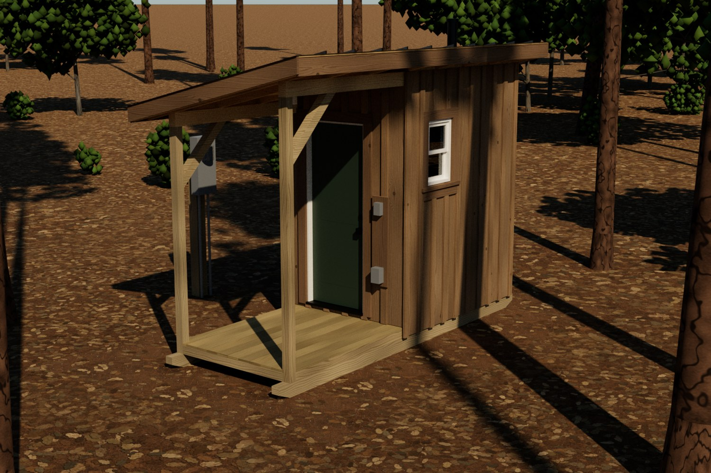
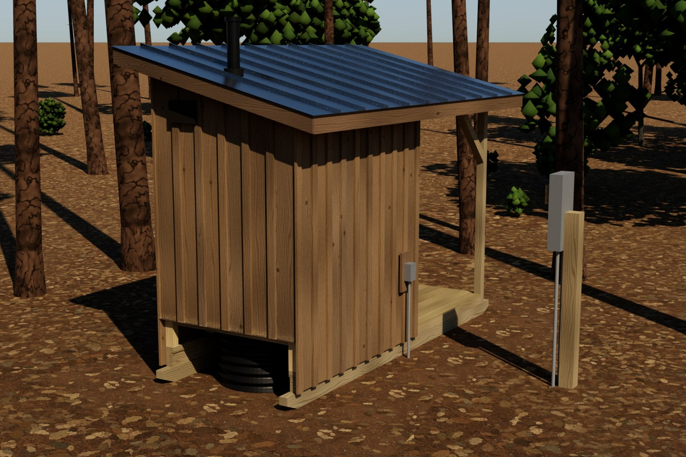
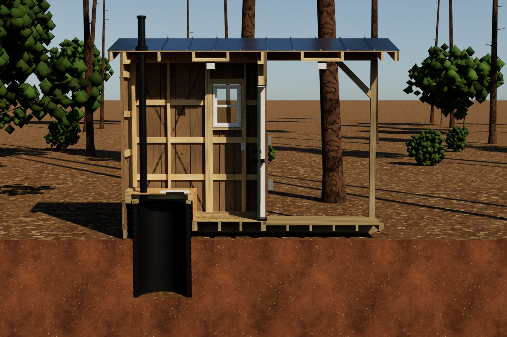

# privy: parametric outhouse, JSON to SVG blueprints to PDF

A skid-mounted pit privy with a covered deck, defined by a single JSON file.
One build turns that file into:

- a 3-D part model: every stud, board, batten, rafter, skid and fastener-bearing piece is a solid;
- architectural sheets as SVG (plans, elevations, sections, framing, details, installation sequence,
  schedules), drawn from the model with hidden-line removal and hatched section cuts;
- path-traced renderings (Mitsuba 3), with materials, sun, sky, site and cameras taken from the JSON;
- one PDF with bookmarks, a cut list CSV and a design-check report.

```
design/privy.json  ──►  privy.model  ──►  drawing/ (SVG sheets) ──► PDF
                                    ├──►  render/  (Mitsuba)    ──► PNG (embedded in the PDF)
                                    └──►  checks, BOM (cut list, purchase list, hardware)
```



The latest drawing set is in [`docs/privy.pdf`](docs/privy.pdf) (18 sheets, 11x17), with the cut list in
[`docs/cut_list.csv`](docs/cut_list.csv).

| Back, panel removed | Cutaway through the pit |
|---|---|
|  |  |

## The design

| | |
|---|---|
| Pit | 30" ID (36" OD) dual-wall corrugated HDPE pipe, set vertically 36" into the ground, open bottom. About 55 gal usable, roughly 12.7 years at 4 people x 25 days/yr |
| Building | 5'-0" x 7'-0" framed, 2x4 @ 24" o.c., rough-sawn SYP 1x10 board-and-batten (full dimension), 6" clearance to grade |
| Foundation | two 4x6 PT (UC4B) skids on edge, 14' long, chamfered both ends, with tow holes. Building and deck ride on one sled |
| Bench | full-width bench over the pipe, seat hole inside the pipe ID. A flange plate, collar and EPDM skirt close the gap between pipe and bench after placement |
| Removable panel | the back wall below the bench is a lagged panel with a PT kick board. Remove it and the privy slides back over the standing pipe: the pipe passes between the skids and under the 4x6 bench header |
| Door | 2'-6" x 6'-8" fiberglass prehung exterior door, in-swing, hinged at the low-side corner so the leaf folds flat against the side wall |
| Roof | single slope 3:12, draining away from the door and the pit. 2x6 rafters on continuous 4x6 beams, 5/8" plywood deck, fly rafters at the rakes, 24 ga Galvalume snap-lock standing seam |
| Window | 18" x 27" double-hung, sill 4'-8" above the floor, on the high side wall |
| Deck | 5'-0" x 6'-0" in front of the door, under the same roof, two 4x4 posts with knee braces |
| Vent | 4" PVC from the flange up through the roof, plus a screened louver high on the back wall for make-up air |
| Electrical | own 100 A meter-main pedestal on a PT post beside the privy (no house on site), one 20 A GFCI circuit to a disconnect at the privy; GFCI receptacle + switch and ceiling light inside, WR GFCI receptacle + switch and deck light outside |

## Usage

```bash
pip install -r requirements.txt           # numpy, cairosvg (needs libcairo), pypdf, pillow, mitsuba, jsonschema
python -m privy build design/privy.json -o build
python -m privy build --no-render         # drawings only (reuses existing renders if present), ~10 s
python -m privy build --quality 0.35      # quick draft renders (~1 min; full quality is ~2-3 min per view on 4 cores)
python -m privy build --only A-101 A-301  # just some sheets
python -m privy build --strict            # exit 1 if a design check fails
python -m privy fmt design/privy.json     # re-format the JSON after editing
```

Outputs: `build/privy.pdf`, `build/svg/*.svg`, `build/renders/*.png`, `build/cut_list.csv`, `build/checks.json`.

## Editing the design

All lengths are inches, either as numbers or as feet-inch strings (`"6'-2 1/2\""`).
Model axes: x runs from the back wall (bench and removable panel) toward the door and deck, y from the low (eave) side to
the high side, and z points up with z = 0 at grade.

| Section | Controls |
|---|---|
| `stock` | every lumber / sheet size used (nominal, surfacing `S4S`/`rough`, actual size override, species, treatment, render material) |
| `pit` | pipe ID/OD, bury depth, clearances, flange, vent, usage (for the pit service-life estimate) |
| `foundation.skids` | stock, `on_edge`/`flat`, overhangs, chamfer, tow hole |
| `building` | width, depth, low bearing height, floor framing, walls (stud spacing, blocking, strap bracing), siding |
| `bench`, `removable_panel`, `door`, `window` | heights, hole setback, seat, rough openings, hardware text |
| `roof` | pitch, overhangs, rafter/purlin spacing, roofing profile |
| `deck` | depth, joists, decking, posts, knee braces |
| `materials` | per material: base color, roughness, metallic, specular, procedural texture (`wood`, `noise`, `soil`, `litter`, `bark`), optional `side_texture` for non-upward faces, per-part `variation`, and the drawing fill and section hatch |
| `lighting` | sun azimuth/elevation (plan angle from +x toward +y), sky turbidity and albedo, exposure, tone map |
| `renders.environment` | dirt pad, surrounding forest floor, trees (species with count, height, trunk diameter, form `pine`/`oak`, bark and foliage materials), understory shrubs, backdrop woods. Placement is seeded and keeps a clear corridor to every camera |
| `renders.views` | cameras (orbit or absolute), optional `hide_tags` (e.g. `removable_panel`), `cutaway` plane, and a per-view `lighting` override |
| `electrical` | service pedestal (rating, location, grounding), branch feed (breaker, design load, voltage-drop limit), device heights and descriptions |
| `drawings` | sheet size, theme (`white` / `blueprint`), plan cut height, allowed scales, general notes |

The schema is in `schema/privy.schema.json` and is validated on every build. Derived geometry is computed, not
hand-entered: the pipe top sits a set clearance below the bench header, the flange collar fills the remaining gap,
the window centers over the standing area, the vent position is searched inside the pipe ID clear of the seat,
rafters and purlins, and so on. If a parameter change breaks a relationship, a check on sheet A-602 fails. Examples:
the pipe no longer clears the skids, the seat hole leaves the pipe ID, or the door header no longer fits under the
sloped plate.

## Code map

| File | Role |
|---|---|
| `privy/model.py` | JSON to parts (the parametric template) |
| `privy/geometry.py` | primitives: prism, tube (with corrugation), plate with hole, corrugated sheet; clipping, sections |
| `privy/checks.py` | fit checks, NDS-style screening checks, snow load, weight and towing force, pit capacity |
| `privy/bom.py` | cut list, first-fit-decreasing purchase list, sheet goods, hardware |
| `privy/drawing/view.py` | orthographic projection, section caps, and painter's ordering: faces are ordered pairwise by depth tests and then topologically sorted |
| `privy/drawing/sheets.py` | sheet layouts, keynotes, dimensions, title block |
| `privy/render/` | Mitsuba 3 scene assembly, procedural textures, NC Piedmont trees (loblolly pine, small oaks) |
| `privy/pdf.py` | SVG to PDF |

The structural rows are screening calculations: simplified NDS allowable stress, No. 2 lumber, snow per ASCE 7 for an
unheated Risk Category I structure. They are not a sealed design. Siting (setbacks from wells and water, soil, and
water table) is governed by the county health department.
